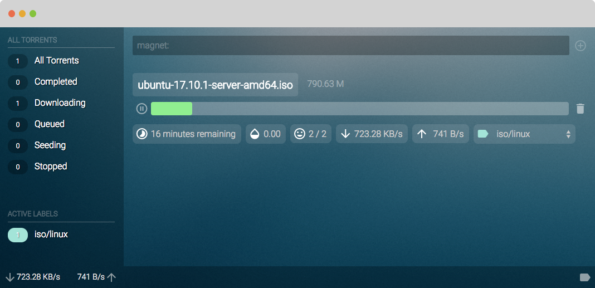

# riptide client

This is the front end app for my other project [riptide-server](https://github.com/akillmer/riptide-server). It's built using ReactJS and Redux, with my own WebSocket middleware. Being my first non-trivial project written with React it was a great learning experience. I'm already gearing up to rewrite this project from scratch (probably with TypeScript).

## Installing
Build the binary for [riptide-server](https://github.com/akillmer/riptide-server) and then build the React app with `npm build`. When you run the `riptide` server binary pass the `-app` flag to point to the React app, e.g. `riptide -app=./riptide-client/build`.

## Caveats
+ Like I previously stated, this is my first "real" React project. *If you're a pro please critique my work, srsly.*
+ Sometimes the torrent's or label's state gets out of sync with the server.
+ There's no mobile ready version, something to address (probably in the next rewrite).